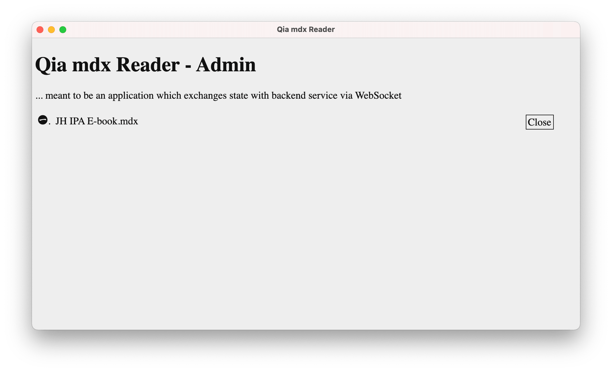
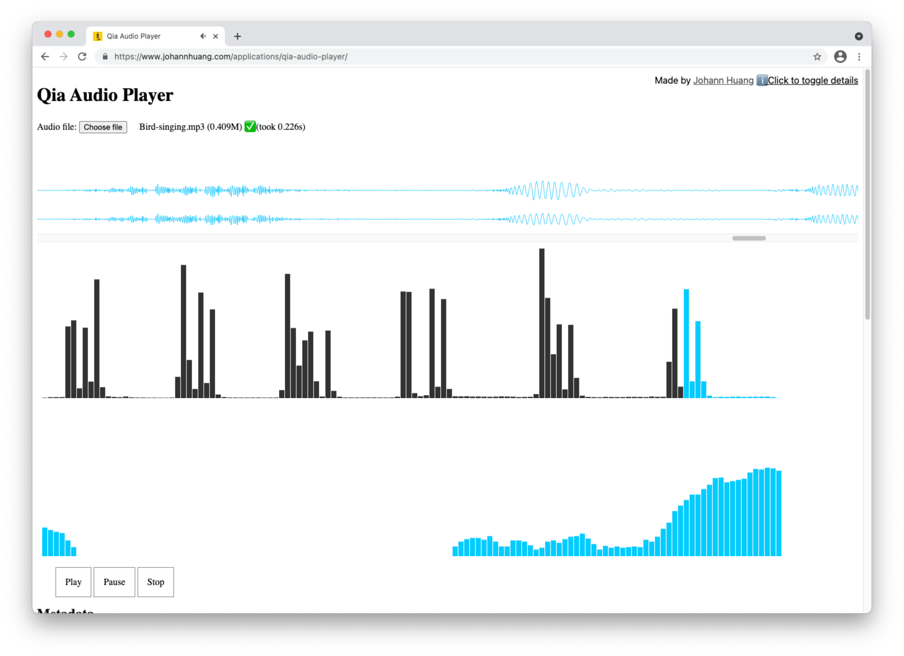

# Qia Software - Documents

Documents for Qia Software

## Qia mdx Reader

* <https://qiasoft-documents.johannhuang.com/qia-mdx-reader/>

## Qia Audio Player

* <https://qiasoft-documents.johannhuang.com/qia-audio-player/>

<!-- Hidden Parts -->

	

